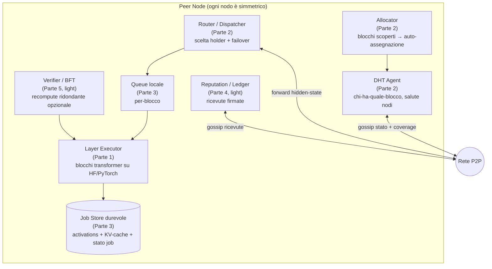

# Parte 0 — Visione & Architettura

> Documento ombrello. Definisce **cosa** stiamo costruendo, **perché**, e **come si compongono i pezzi**. Le decisioni implementative concrete vivono negli [ADR](./decisions/); i dettagli per-sottosistema nelle [PRD](./prd/).

## 1. Visione

Synapse è una **rete di inferenza LLM completamente decentralizzata e peer-to-peer**. Un grande modello viene suddiviso in **blocchi di layer**; ogni nodo della rete ospita ed esegue uno o più blocchi. Quando un utente fa una domanda, i **vettori di stato nascosto (hidden states)** vengono instradati attraverso i nodi responsabili dei blocchi, in sequenza, fino a produrre la risposta. Nessun server centrale: la rete *è* il modello.

### Il reframe che definisce tutto: alta latenza

La caratteristica distintiva non è la velocità, è la **tolleranza a latenze altissime** — una risposta può arrivare dopo **ore, giorni o settimane**. Questo cambia il modello mentale:

> **Synapse ≈ "BOINC / SETI@home per i layer di un LLM"**, non "Petals in tempo reale".

L'inferenza **non** è una sessione live su socket: è un **job durevole** che avanza hop-by-hop tramite **store-and-forward**. Ogni hop persiste lo stato intermedio e lo inoltra quando il prossimo nodo è raggiungibile. Questa rinuncia al real-time è una **liberazione**:

- possiamo **aspettare** che un nodo torni online;
- possiamo **accodare** senza budget di latenza;
- il **failover** è banale: ri-dispacciamo lo stage corrente a un holder ridondante.

## 2. Obiettivi

### Obiettivi del primo PoC (in scope)
- Inferenza distribuita di un modello **1–3B** su **2–3 nodi reali**.
- **Discovery distribuita** (DHT): quale nodo gestisce quale blocco, stato dei nodi.
- **Allocazione dinamica dei layer**: un nuovo nodo si auto-assegna blocchi *non ancora coperti*.
- **Operatività progressiva**: il modello diventa operativo solo quando **ogni blocco è coperto da ≥1 nodo**; prima le richieste si accodano.
- **Queue asincrona + store-and-forward** durevole.
- **Ridondanza e failover automatico**.
- **Reputazione minimale**.

### Non-goals del PoC (YAGNI / rimandati)
- ❌ Token/criptovaluta on-chain (progettato su carta — Parte 4).
- ❌ BFT completo con consenso economico/slashing (progettato su carta — Parte 5).
- ❌ Modelli 70B+ e tensor-parallelism avanzato.
- ❌ UI sofisticata.

## 3. Principi guida

1. **Asincronia prima di tutto** — ogni componente assume che le risposte possano tardare; niente assunzioni di real-time.
2. **Nodi simmetrici** — nessun ruolo speciale; ogni peer può fare entry/coordinator, executor, router.
3. **Decentralizzazione** — niente single point of failure (un seed/bootstrap node è ammesso solo come scorciatoia temporanea del PoC, da rimuovere).
4. **Ridondanza per resilienza** — più nodi possono servire lo stesso blocco.
5. **Degradazione graduale** — fallimenti parziali della rete accodano lavoro, non lo perdono.
6. **YAGNI** — costruiamo il minimo eseguibile; il resto è progettato ma rimandato.

## 4. Glossario

| Termine | Significato |
|---------|-------------|
| **Blocco (layer block)** | Insieme contiguo di layer transformer servito da un nodo. L'unità di sharding. |
| **Hidden state / activation** | Il vettore (seq_len × hidden_dim) passato tra blocchi. |
| **Holder** | Nodo che serve un dato blocco. Un blocco può avere più holder (ridondanza). |
| **Job** | Una richiesta di inferenza, durevole, identificata da `job_id`. |
| **Coverage** | Insieme dei blocchi attualmente serviti da ≥1 nodo. |
| **Entry node** | Il nodo che riceve la domanda dell'utente e fa da coordinator per quel job. |
| **KV-cache** | Cache attention per-sequenza, mantenuta dall'holder per i suoi blocchi durante la generazione. |

## 5. Architettura — mappa dei componenti

Ogni nodo è **identico** ed esegue tutti questi sottosistemi:



## 6. Flusso dati — pipeline autoregressiva in store-and-forward

```mermaid
sequenceDiagram
    actor User
    participant Entry as Entry Node
    participant B0 as Holder blocco 0
    participant Bi as Holder blocco i
    participant Head as Holder LM head
    User->>Entry: prompt
    Entry->>Entry: tokenize + embed -> h0; crea job_id; persiste
    Entry-->>User: "accettato, poll job_id"
    Entry->>B0: dispatch(job, h0)
    B0->>B0: forward blocco -> h1; persiste; aggiorna KV
    B0->>Bi: dispatch(job, h1)
    Bi->>Head: ... -> hN
    Head->>Head: logits -> sample token t
    Head->>Entry: token t (autoregressivo: rientra in pipeline)
    Note over Entry,Head: ripete finché EOS;<br/>KV-cache persiste presso ogni holder (affinità per job)
    Head->>Entry: risposta completa
    User->>Entry: poll(job_id) -> risposta
```

Pipeline in forma compatta:

```
prompt ─▶ [entry: tokenize+embed] ─▶ h0
   │  (job_id persistito; risposta async via poll/callback)
   ▼  per ogni blocco b0..bN:
 [holder bi] carica h_{i-1} ─▶ calcola h_i ─▶ PERSISTE ─▶ dispatch a b{i+1}
   (holder morto ⇒ ri-dispaccio a holder ridondante; replay KV se serve)
   ▼  [holder LM head] hN ─▶ logits ─▶ sample token t
   ▼  autoregressivo: t rientra in pipeline finché EOS
   ▼  risposta completa scritta sul job ─▶ utente la ritira
```

**Punto tecnico più delicato:** la **KV-cache distribuita con affinità di job**. Ogni holder mantiene la cache per i suoi blocchi durante la generazione di una sequenza; se cade, si fa *replay* dei suoi layer per quel job presso un holder ridondante.

## 7. Allocazione dinamica & operatività progressiva

```mermaid
stateDiagram-v2
    [*] --> Incompleto
    Incompleto --> Incompleto: nodo entra,<br/>auto-assegna blocco scoperto
    Incompleto --> Operativo: tutti i blocchi coperti (≥1 holder)
    Operativo --> Degradato: un holder cade
    Degradato --> Operativo: failover su ridondante<br/>o nuovo holder
    Degradato --> Incompleto: blocco rimane scoperto
    Operativo --> Operativo: job processati;<br/>richieste accodate per layer
    Incompleto --> Incompleto: richieste in coda (non perse)
```



Man mano che i nodi si aggiungono, il modello **si compone progressivamente** nella rete. Finché la coverage è incompleta, le richieste restano in coda durevole.

## 8. Modello di sicurezza & BFT (sintesi — dettagli in Parte 5)

- **Nodo malevolo** può restituire activation spazzatura → mitigazione: **recompute ridondante** presso ≥2 holder + confronto entro tolleranza numerica; reputazione penalizzata in caso di divergenza.
- **Sybil** → nel PoC reputazione + costo di partecipazione; on-chain stake rimandato.
- **Fallimenti parziali della rete** → store-and-forward + queue durevole assorbono partizioni temporanee: il lavoro si accoda, non si perde.
- **Integrità in transito** → hidden states firmati/hashati per hop (commit-reveal completo rimandato).

## 9. Le 5 forcelle implementative (decise)

Confrontate da un **team di agent** (workflow `synapse-impl-forks`, 9 agent) e cristallizzate in **[ADR-0001](./decisions/ADR-0001-implementation-forks.md)**. Sintesi:

| # | Decisione | Esito |
|---|-----------|-------|
| A | Substrate P2P / DHT | `hivemind.DHT` **solo discovery/metadati** dietro `DiscoveryProvider` (fallback kademlia); mai routing attivazioni via hivemind |
| B | Runtime esecuzione layer | Block-runner sottile su HF (`init_empty_weights` + load parziale); KV-cache serializzabile che possediamo |
| C | Modello job async | Store-and-forward + Milestone-0 orchestrator; substrato unico **SQLite(WAL) + safetensors** keyed `(job_id, stage)` |
| D | Verifica / BFT (PoC) | Reputazione + recompute **campionato 5-10%**, confronto **fp32 con tolleranza** (mai hash) |
| E | Allocazione / coverage | **Conteggio diretto chiavi DHT** (gossip-CRDT rimandato a v1.1) |

I **3 primitivi condivisi** che tengono insieme lo stack: (1) schema record DHT, (2) substrato durevole SQLite+safetensors, (3) chiave di idempotenza `(job_id, stage)`. Dettaglio in [ADR-0001](./decisions/ADR-0001-implementation-forks.md).

## 10. Riferimenti

- **Petals** (BigScience) — inferenza decentralizzata di LLM su rete P2P. Prior art per esecuzione per-blocco e KV-cache lato server.
- **hivemind** (learning@home) — DHT su libp2p + comunicazione decentralizzata. Substrate candidato.
- **BOINC / SETI@home** — modello di calcolo volontario asincrono a larga scala. Ispirazione per il modello a job.
- **Kademlia** — DHT usato per discovery.
