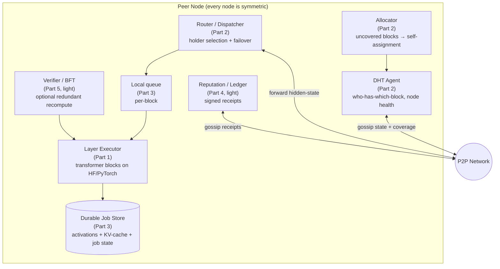

# Part 0 — Vision & Architecture

> Umbrella document. It defines **what** we are building, **why**, and **how the pieces fit together**. The concrete implementation decisions live in the [ADRs](./decisions/); the per-subsystem details in the [PRDs](./prd/).

## 1. Vision

Axyn is a **fully decentralized, peer-to-peer LLM inference network**. A large model is split into **layer blocks**; each node in the network hosts and runs one or more blocks. When a user asks a question, the **hidden-state vectors (hidden states)** are routed through the nodes responsible for the blocks, in sequence, until the answer is produced. No central server: the network *is* the model.

### The reframe that defines everything: high latency

The defining trait is not speed, it is **tolerance to extremely high latencies** — an answer may arrive after **hours, days or weeks**. This changes the mental model:

> **Axyn ≈ "BOINC / SETI@home for the layers of an LLM"**, not "real-time Petals".

Inference is **not** a live socket session: it is a **durable job** that advances hop-by-hop via **store-and-forward**. Each hop persists the intermediate state and forwards it when the next node is reachable. Giving up real-time is a **liberation**:

- we can **wait** for a node to come back online;
- we can **queue** without a latency budget;
- **failover** is trivial: we re-dispatch the current stage to a redundant holder.

## 2. Goals

### First PoC goals (in scope)
- Distributed inference of a **1–3B** model across **2–3 real nodes**.
- **Distributed discovery** (DHT): which node serves which block, node status.
- **Dynamic layer allocation**: a new node self-assigns blocks *not yet covered*.
- **Progressive operability**: the model becomes operational only when **every block is covered by ≥1 node**; before that, requests are queued.
- **Asynchronous queue + durable store-and-forward**.
- **Redundancy and automatic failover**.
- **Minimal reputation**.

### PoC non-goals (YAGNI / deferred)
- ❌ On-chain token/cryptocurrency (designed on paper — Part 4).
- ❌ Full BFT with economic consensus/slashing (designed on paper — Part 5).
- ❌ 70B+ models and advanced tensor parallelism.
- ❌ Sophisticated UI.

## 3. Guiding principles

1. **Asynchrony first** — every component assumes responses may be delayed; no real-time assumptions.
2. **Symmetric nodes** — no special roles; every peer can act as entry/coordinator, executor, router.
3. **Decentralization** — no single point of failure (a seed/bootstrap node is allowed only as a temporary PoC shortcut, to be removed).
4. **Redundancy for resilience** — multiple nodes can serve the same block.
5. **Graceful degradation** — partial network failures queue work, they do not lose it.
6. **YAGNI** — we build the minimum that runs; the rest is designed but deferred.

## 4. Glossary

| Term | Meaning |
|---------|-------------|
| **Block (layer block)** | A contiguous set of transformer layers served by a node. The sharding unit. |
| **Hidden state / activation** | The vector (seq_len × hidden_dim) passed between blocks. |
| **Holder** | A node that serves a given block. A block can have multiple holders (redundancy). |
| **Job** | An inference request, durable, identified by `job_id`. |
| **Coverage** | The set of blocks currently served by ≥1 node. |
| **Entry node** | The node that receives the user's question and acts as coordinator for that job. |
| **KV-cache** | Per-sequence attention cache, kept by the holder for its blocks during generation. |

## 5. Architecture — component map

Every node is **identical** and runs all of these subsystems:



## 6. Data flow — autoregressive store-and-forward pipeline

```mermaid
sequenceDiagram
    actor User
    participant Entry as Entry Node
    participant B0 as Holder block 0
    participant Bi as Holder block i
    participant Head as Holder LM head
    User->>Entry: prompt
    Entry->>Entry: tokenize + embed -> h0; create job_id; persist
    Entry-->>User: "accepted, poll job_id"
    Entry->>B0: dispatch(job, h0)
    B0->>B0: forward block -> h1; persist; update KV
    B0->>Bi: dispatch(job, h1)
    Bi->>Head: ... -> hN
    Head->>Head: logits -> sample token t
    Head->>Entry: token t (autoregressive: re-enters pipeline)
    Note over Entry,Head: repeats until EOS;<br/>KV-cache persists at each holder (per-job affinity)
    Head->>Entry: complete response
    User->>Entry: poll(job_id) -> response
```

Pipeline in compact form:

```
prompt ─▶ [entry: tokenize+embed] ─▶ h0
   │  (job_id persisted; response async via poll/callback)
   ▼  for each block b0..bN:
 [holder bi] loads h_{i-1} ─▶ computes h_i ─▶ PERSISTS ─▶ dispatch to b{i+1}
   (dead holder ⇒ re-dispatch to a redundant holder; replay KV if needed)
   ▼  [holder LM head] hN ─▶ logits ─▶ sample token t
   ▼  autoregressive: t re-enters pipeline until EOS
   ▼  complete response written to the job ─▶ user retrieves it
```

**Trickiest technical point:** the **distributed KV-cache with job affinity**. Each holder keeps the cache for its blocks during the generation of a sequence; if it goes down, its layers for that job are *replayed* at a redundant holder.

## 7. Dynamic allocation & progressive operability

```mermaid
stateDiagram-v2
    [*] --> Incomplete
    Incomplete --> Incomplete: node joins,<br/>self-assigns uncovered block
    Incomplete --> Operational: all blocks covered (≥1 holder)
    Operational --> Degraded: a holder goes down
    Degraded --> Operational: failover to redundant<br/>or new holder
    Degraded --> Incomplete: block stays uncovered
    Operational --> Operational: jobs processed;<br/>requests queued per layer
    Incomplete --> Incomplete: requests queued (not lost)
```



As nodes are added, the model **composes progressively** across the network. As long as coverage is incomplete, requests stay in a durable queue.

## 8. Security model & BFT (summary — details in Part 5)

- **Malicious node** can return garbage activations → mitigation: **redundant recompute** at ≥2 holders + comparison within numerical tolerance; reputation penalized on divergence.
- **Sybil** → in the PoC, reputation + cost of participation; on-chain stake deferred.
- **Partial network failures** → store-and-forward + durable queue absorb temporary partitions: work is queued, not lost.
- **In-transit integrity** → hidden states signed/hashed per hop (full commit-reveal deferred).

## 9. The 5 implementation forks (decided)

Compared by a **team of agents** (`axyn-impl-forks` workflow, 9 agents) and crystallized in **[ADR-0001](./decisions/ADR-0001-implementation-forks.md)**. Summary:

| # | Decision | Outcome |
|---|-----------|-------|
| A | P2P / DHT substrate | `hivemind.DHT` **for discovery/metadata only** behind `DiscoveryProvider` (kademlia fallback); never route activations via hivemind |
| B | Layer execution runtime | Thin block-runner on HF (`init_empty_weights` + partial load); serializable KV-cache that we own |
| C | Async job model | Store-and-forward + Milestone-0 orchestrator; single substrate **SQLite(WAL) + safetensors** keyed `(job_id, stage)` |
| D | Verification / BFT (PoC) | Reputation + **5–10% sampled** recompute, **fp32 comparison with tolerance** (never hash) |
| E | Allocation / coverage | **Direct DHT key counting** (gossip-CRDT deferred to v1.1) |

The **3 shared primitives** that hold the stack together: (1) the DHT record schema, (2) the durable SQLite+safetensors substrate, (3) the `(job_id, stage)` idempotency key. Detail in [ADR-0001](./decisions/ADR-0001-implementation-forks.md).

## 10. References

- **Petals** (BigScience) — decentralized LLM inference over a P2P network. Prior art for per-block execution and server-side KV-cache.
- **hivemind** (learning@home) — DHT over libp2p + decentralized communication. Candidate substrate.
- **BOINC / SETI@home** — large-scale asynchronous volunteer computing model. Inspiration for the job model.
- **Kademlia** — DHT used for discovery.
