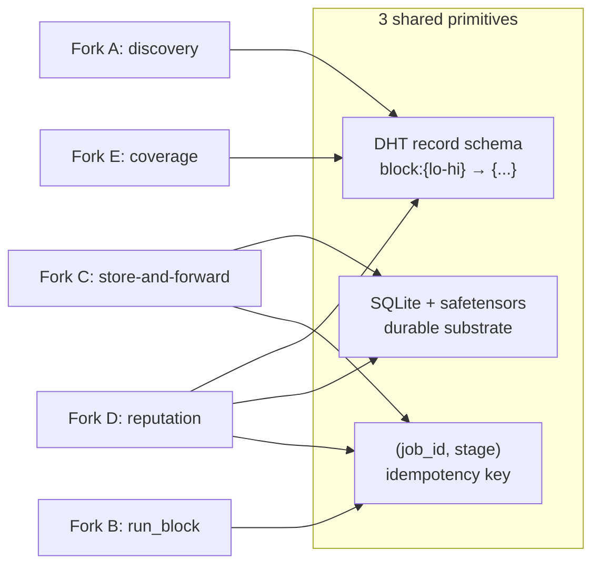

# ADR-0001 — Implementation paths for the PoC

- **Status:** Accepted
- **Date:** 2026-06-17
- **Deciders:** `eujeno-impl-forks` agent team (9 agents: 5 per-fork specialists, 3 stack architects, 1 synthesis lead architect) + user review
- **Context:** [00-vision-architecture.md](../00-vision-architecture.md)

## Context

Five cross-cutting implementation decisions ("forks") gating the entire architecture were contested. A team of agents compared them in depth (with web verification of library status as of June 2026) and produced an integrated recommendation. This ADR crystallizes the outcome.

The evaluation criteria, in order of weight: (1) time-to-runnable-PoC, (2) correctness of distributed autoregressive inference + KV-cache, (3) alignment with the async/store-and-forward framing, (4) extensibility toward the deferred parts, (5) operational risk / library maturity.

## Decisions per fork

| # | Fork | Decision | Rejected alternatives |
|---|----------|-----------|----------------------|
| **A** | P2P/DHT substrate | **`hivemind.DHT` as the discovery/metadata plane ONLY**, behind a `DiscoveryProvider` interface. `bmuller/kademlia` vendored as a LAN/VPN fallback. **Never** route activations via hivemind RPC/streaming. | `kademlia` as primary (UDP-only, no NAT traversal, dormant since 2021); py-libp2p (kad-DHT immature in 2026); go-libp2p sidecar (1-2 weeks of IPC bridge, wrong phase) |
| **B** | Layer execution runtime | **Thin block-runner over HF transformers**: `init_empty_weights()` + `load_checkpoint_in_model()` to materialize only the assigned layers `model.model.layers[i:j]`. Embedding and lm_head are blocks too. KV-cache = a serializable `DynamicCache` that we own, persisted per `(job_id, stage)`. | Reusing Petals internals (frozen at 2.2.0, no Llama 3.2/Qwen2.5, KV-cache welded to a live hivemind session = the low-latency model we relaxed); custom forward pass (re-deriving each architecture, wrong phase) |
| **C** | Async job model | **Store-and-forward as the north star; orchestrator-driven entry-node as Milestone 0**, both writing to the same durable substrate: **SQLite (WAL) per-node job log + safetensors blobs on disk** keyed `(job_id, stage)`. Idempotent hops (ACK-after-persist, dedup on `(job_id, stage)`). M0→peer-driven migration = deleting the central loop, not rewriting the persistence. | Orchestrator-driven as the final design (entry node = multi-day SPOF); Temporal/Ray/Celery (central broker = SPOF, against the decentralized thesis); Redis Streams (extra daemon for no PoC benefit) |
| **D** | Verification / BFT | **Always-on reputation** (`reputation` field in the DHT record) **+ sampled redundant recompute ~5-10%** (biased toward new/low-score nodes), comparing activations promoted to **fp32 with tolerance** (`torch.allclose` atol~1e-2 / rtol~1e-3). **Never hash-compare.** Verify stateless/prefill hops only. | Verifying every stage (~2x compute, kills the async advantage); commit-reveal of hashes (fatally incompatible with FP non-determinism across heterogeneous hardware — honest nodes produce different bytes) |
| **E** | Allocation / coverage | **Direct DHT key counting** for the PoC: `coverage = all(DHT.get(block_i) returns ≥1 live holder)`. Self-assign an uncovered block at random (or least-replicated) with jittered backoff. Local TTL 2-5s cache on the hot path. CRDT map via gossip = v1.1 upgrade. | Gossip-CRDT map as primary (over-engineered for 2-3 nodes); elected coordinator/Raft (reintroduces a central point, violates peer symmetry) |

## Integrated stack — the 3 shared primitives

The five choices compose into **a single seam** around three primitives that the whole system shares:

1. **DHT record schema** — `block:{lo-hi} → {peer_id, queue_url, block, expiry, load, reputation}` with TTL ~60s. Read/written by A (discovery), D (reputation), E (coverage).
2. **Durable SQLite + safetensors substrate** — per-node job log + activation/KV blobs on disk. Shared by C (store-and-forward) and D's failover-and-verify.
3. **`(job_id, stage)` idempotency key** — aligns hops, KV-cache, re-dispatch, and verification on a single code path.

> **The decisive architectural cut:** separating Petals' two contributions. We reuse the *idea* of running blocks via HF decoder modules (Fork B) but **discard** Petals' synchronous low-latency RPC/streaming — exactly the property we relaxed. hivemind only serves metadata; activations travel over **our** durable transport.

## Sequencing — Milestone 0 → decentralization

We buy speed (criterion 1) without sacrificing async alignment (criterion 3): we ship **first** an orchestrator-driven entry-node that writes to the **same** durable substrate, **then** decentralize by deleting the central loop. No broker, no coordinator, no Petals dependency.

## Build order (prototype-first)

These steps become the implementation milestones (see [ROADMAP](../ROADMAP.md)):

1. **Single-process golden reference** — load a small model (Qwen2.5-0.5B or Llama 3.2 1B), generate, capture reference logits/tokens for a fixed prompt.
2. **Single-process manual block-split** — split into 2-3 in-process block-runners called in sequence with a `DynamicCache` passed by hand; assert `torch.allclose` vs step 1. **De-risk KV-cache/RoPE/position_ids before any networking.**
3. **Two real processes on localhost** — FastAPI + in-memory safetensors, static routing, single forward, activation persisted to SQLite+disk; re-assert equality vs golden.
4. **Autoregressive loop with session affinity** — KV-cache pinned per `(job_id, block)`; the message carries only the new token's hidden state. Re-assert sequence == golden.
5. **p2pd/hivemind.DHT smoke test** on the 2-3 REAL nodes (laptop + VM/container): store/get a record, verify NAT traversal + TTL liveness. **Gate before proceeding.**
6. **DHT lookup + self-assignment + coverage gate** — replaces static routing; prove that a job goes to `WAITING_COVERAGE` when a block is uncovered and resumes when a node self-assigns.
7. **Durable store-and-forward failover** — kill a holder mid-generation, prove that the stage re-dispatches from the persisted activation (with prefix recompute) and the generation completes correctly.
8. **Light reputation + sampled recompute** on prefill hops; demote a deliberately faulty node.
9. **Final refactor** — delete the orchestrator loop, each node pull/forward peer-to-peer over the same SQLite substrate (M0 → store-and-forward migration).

## Main risks & mitigations

| Risk | Mitigation |
|---------|-------------|
| **KV-cache correctness across hops and restart/failover** — this is where the PoC lives or dies. An off-by-one in `position_ids`/`cache_position` after a resumed hop, or a double-append on re-dispatch, silently corrupts the generation. | `golden_test` single-process **first**, re-run at **every** step before adding networking/failover. Idempotent cache writes keyed `(job_id, stage, token_position)`. KV-cache as a serializable object (never a live session handle). |
| **KV-cache loss on mid-pipeline death** → O(seq_len) recompute of the prefix; under churn this becomes pathological. | PoC: accept recompute-from-prompt on the failed block only. Per-block checkpointing policy as a v1.1 item. Least-replicated self-assign to keep blocks warm at replication ≥2. |
| **`p2pd` arch-mismatch** (Apple Silicon laptop vs x86 VM) → silent hang; unreachable bootstrap → DHT split-brain. | p2pd smoke test as a **build-order gate** before model work. Pin `initial_peers` to a known seed. `DiscoveryProvider` interface as an escape hatch toward kademlia on a flat VPN. |
| **FP non-determinism** makes equality-based verification fragile. | Never hash-compare. Promote to fp32, `torch.allclose` (atol~1e-2, rtol~1e-3). Sample only ~5-10% of stateless/prefill hops, reputation-gated. |
| **Scope creep in the hand-owned transport** eats the criterion-1 budget. | Minimal transport: HTTP via FastAPI/uvicorn with safetensors-bytes body, **fixed** model id + dtype in v1, no protocol negotiation, no quantization. SQLite (not Redis/NATS) = zero ops. |

## Open questions (to resolve during implementation)

1. **PoC node matrix:** are the 2-3 nodes on a flat LAN/VPN (kademlia fallback viable) or behind real NAT (hivemind's NAT traversal load-bearing)? Decides how much the `DiscoveryProvider` fallback matters.
2. **transformers Cache API version:** pin a version and confirm that `DynamicCache` round-trips serialization cleanly per architecture.
3. **KV-cache failover policy beyond the PoC:** accept a full prefix recompute, or periodic per-block checkpointing? Decide the v1.1 trigger threshold (e.g. `seq_len > N`).
4. **Empirical fp32 tolerance values** (atol/rtol) on real heterogeneous hardware: these must be **measured**, not assumed.
5. **Block granularity & edge-node:** embedding and lm_head as standalone blocks (simpler) or co-located with the first/last decoder slab? Impacts coverage math and RAM fit.
6. **DHT record signing:** add signed records now (cheap forward-compat for reputation/BFT) or defer? hivemind supports it.
7. **Outbox retention/pruning policy** and backpressure limits to avoid unbounded growth when a downstream block stays uncovered.

## References

- [hivemind · PyPI](https://pypi.org/project/hivemind/) (release 2026-01-03, Py3.9-3.12) · [learning-at-home/hivemind](https://github.com/learning-at-home/hivemind)
- [Petals releases](https://github.com/bigscience-workshop/petals/releases) (frozen 2.2.0)
- [accelerate big-model inference](https://huggingface.co/docs/accelerate/usage_guides/big_modeling)
- [Defeating Nondeterminism in LLM Inference — Thinking Machines](https://thinkingmachines.ai/blog/defeating-nondeterminism-in-llm-inference/) · [arXiv 2408.05148](https://arxiv.org/pdf/2408.05148)
