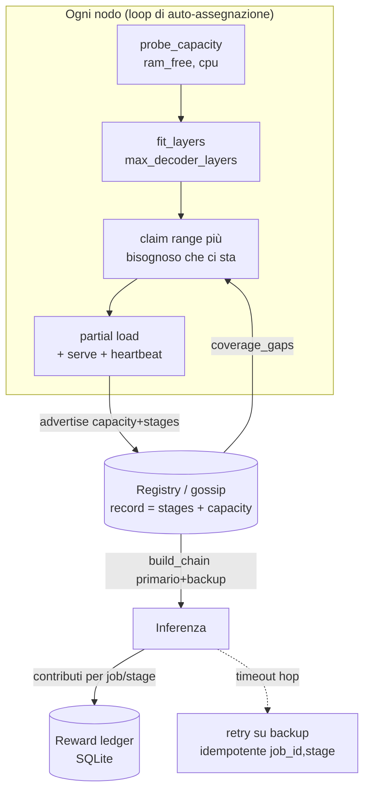

# ADR-0003 — Allocazione capacity-aware distribuita (auto-assemblaggio, ridondanza, reward)

**Stato:** Proposto · 2026-06-17
**Contesto PRD:** [part-2 discovery/routing](../prd/part-2-discovery-routing.md), [part-3 queue/load-balancing](../prd/part-3-queue-load-balancing.md), [part-4 incentives/reputation](../prd/part-4-incentives-reputation.md)
**Dipende da:** [ADR-0001](./ADR-0001-implementation-forks.md) (schema record DHT, substrato SQLite, idempotenza `(job_id, stage)`), [ADR-0002](./ADR-0002-connettivita-nat.md) (P2P puro + coordinator)

---

## 1. Problema

Oggi lo split di un modello sui nodi è **manuale**: l'operatore passa `--stages "embed,decoder:0-12"` a mano. Mancano tre capacità:

1. **Sapere cosa regge un nodo.** Un nodo da 4 GB non può ospitare gli stessi layer di uno da 32 GB. Serve misurare la RAM disponibile e tradurla in "quanti layer". *(Il comando `synapse fit` già fa il calcolo a mano — vedi §4.1.)*
2. **Auto-assemblaggio.** I nodi dovrebbero coprire da soli i layer mancanti `[0,N) + embed + head`, senza che un umano assegni i range.
3. **Reward proporzionale alle risorse.** Chi mette a disposizione più RAM/layer, più uptime e serve più token deve guadagnare di più.

## 2. Decisione

| Dimensione | Scelta | Motivo |
|---|---|---|
| **Allocazione** | **Distribuita / auto-assegnazione** | Ogni nodo legge i buchi di coverage dal registry + la propria capacità e **rivendica** un range. Nessun cervello centrale → coerente col P2P puro (ADR-0002). In modalità coordinator si riusano gli stessi record di capacità. |
| **Reward** | **Ledger off-chain (punti)** | Token rinviati. Contabilità a punti persistita (SQLite, ADR-0001); formula e unità stabili → ancorabili a token in seguito senza riprogettare. |
| **Ridondanza** | **Target ≥2 nodi per range + failover** | Allineato all'obiettivo "failover automatico". L'inferenza instrada su un primario e ripiega su un backup. |

> **Principio guida (BOINC):** l'allocazione è asincrona e a **consistenza eventuale**. Non serve un consenso forte in tempo reale: i buchi si chiudono per convergenza, i conflitti si risolvono con tie-break deterministico + backoff. La rinuncia al real-time (ADR-0002) rende tutto questo più semplice, non più difficile.

## 3. Architettura



### 3.1 Componenti (file)

| File | Responsabilità |
|---|---|
| `synapse/net/capacity.py` *(nuovo)* | `probe_capacity() -> {ram_total_gb, ram_free_gb, cpu_count}` e `fit_layers(dims, dtype, ram_gb, reserve) -> {ram_per_layer, max_decoder_layers, ram_embed_head, fits_whole}`. **Refactor**: la matematica è quella già scritta in `cli.py::fit` — la si estrae qui e `fit` la richiama (DRY). |
| `synapse/net/discovery.py` *(mod)* | `coverage_gaps(registry, num_layers, target=2) -> [{lo, hi, replicas}]`: range decoder scoperti o **sotto-replicati**, + stato di `embed`/`head`. Ordina per urgenza (scoperti prima, poi sotto-replicati). |
| `synapse/net/allocator.py` *(nuovo)* | Loop di auto-assegnazione su ogni nodo (§3.3). |
| `synapse/net/rewards.py` *(nuovo)* | Ledger a punti (§3.5) su SQLite (ADR-0001). |
| `synapse/cli.py` *(mod)* | `serve --auto` (auto-assegnazione invece di `--stages` fisso); `rewards [--node]`. |
| record schema *(mod)* | Aggiunge `capacity` al record di gossip/registry (§3.2). |

### 3.2 Advertisement della capacità (schema record, additivo)

Il record di presenza del nodo nel registry (oggi: `url`, `stages`, `model`) acquisisce un campo **`capacity`**:

```json
{
  "url": "http://10.0.0.4:8001",
  "stages": "decoder:0-8",
  "model": "Qwen/Qwen2.5-7B-Instruct",
  "capacity": {
    "ram_total_gb": 16.0, "ram_free_gb": 11.2, "cpu_count": 8,
    "max_decoder_layers": 22, "dtype": "bfloat16"
  }
}
```

Additivo e retro-compatibile: un record senza `capacity` è trattato come capacità ignota (peso minimo nell'allocazione). Nessuna rottura con i nodi esistenti.

### 3.3 Loop di auto-assegnazione (`serve --auto`)

Un nodo avviato con `--auto` (anziché `--stages` fisso):

1. **Misura** — `caps = probe_capacity()` → `fit_layers(...)` → numero massimo di layer ospitabili nel dtype scelto.
2. **Osserva** — `gaps = coverage_gaps(registry, N, target=2)`, ordinati per urgenza. `embed`/`head` (gli outlier di memoria: matrice `vocab × hidden`) vengono preferiti dai nodi capienti.
3. **Rivendica** — sceglie il gap più urgente che **ci sta** nella sua capacità e annuncia via gossip gli `stages` intesi, con `claim_ts` + `node_id`.
4. **Risolve i conflitti** — se due nodi rivendicano range sovrapposti: tie-break deterministico (`claim_ts` più vecchio, a parità `node_id` più basso); il perdente fa **backoff con jitter** e ri-valuta il gap successivo. Converge perché i buchi si restringono a ogni giro.
5. **Carica e serve** — partial loading dei soli layer assegnati, poi heartbeat periodico di `capacity` + `stages`.

**Anti-thrashing (isteresi):** un nodo **preferisce mantenere** la propria assegnazione; ri-assegna solo se un gap persiste per `T` secondi. Evita il flapping su fluttuazioni transitorie del registry.

**Trigger di ri-valutazione:** ingresso/uscita di un nodo (cambia la coverage) e **timeout di heartbeat di un peer** → il suo range diventa sotto-replicato → un nodo con capacità libera lo rivendica = **failover dell'allocazione**.

### 3.4 Ridondanza + failover in inferenza

- L'allocatore mira a coprire ogni range decoder + `embed` + `head` con **≥2 nodi**.
- `build_chain` (già esistente) viene esteso per scegliere, per ogni stage, un **primario** e conoscere i **backup**.
- A runtime, se un hop va in timeout/errore di transport, si **ritenta sul backup**. La ritrasmissione è sicura grazie all'idempotenza `(job_id, stage)` (ADR-0001 #3): un hop ripetuto non duplica il lavoro né la contabilità reward.

### 3.5 Reward ledger (off-chain, a punti)

Contabilità per **epoca** (ogni K minuti) e per **job completato**:

```
reward(nodo) +=  hosted_layers × ram_per_layer_bytes      # risorse impegnate
              ×  uptime_frac                                # affidabilità nell'epoca
              ×  tokens_served                              # lavoro utile effettivo
              ×  redundancy_bonus(range)                    # bonus se il range ha pochi replica
```

- `redundancy_bonus` è **più alto per i range con meno replica** → incentiva a coprire ciò che scarseggia (anti-collasso della rete).
- **Attribuzione `tokens_served`:** ogni stage che processa un hop di un job registra un contributo; alla chiusura del job l'entry (coordinator in modalità relay, o il peer d'ingresso in P2P) ripartisce i punti tra i nodi contributori, **chiavato su `(job_id, stage)`** per non contare due volte i retry.
- **Persistenza:** tabella `ledger(node_id, epoch, points, layers, tokens, uptime)` su SQLite (substrato ADR-0001 #2).
- **Esposizione:** `synapse rewards [--node <id>]` + endpoint `/rewards` + tab nel frontend.
- **Tokenizzazione futura:** la formula e le unità (punti) restano stabili; solo il *settlement layer* (token on-chain, claim per epoca) si aggiunge dopo, senza toccare la contabilità.

## 4. Superficie CLI

| Comando | Stato |
|---|---|
| `synapse fit --model <id> --ram <GB> [--dtype]` | ✅ Fatto (calcolo manuale, riusato dall'allocatore) |
| `synapse serve --auto` | 🔜 Auto-assegnazione invece di `--stages` |
| `synapse rewards [--node <id>]` | 🔜 Mostra il ledger |
| `synapse model --info` | ✅ Fornisce le dimensioni per il calcolo |

### 4.1 Stato di partenza
`synapse fit` (già su `main`) calcola `ram_per_layer ≈ params_layer × bytes` con `params_layer ≈ 2·hidden² + 2·hidden·kv_dim + 3·hidden·intermediate`, e suggerisce uno stage spec. La stessa funzione diventa `capacity.fit_layers` e alimenta il passo 1 del loop di auto-assegnazione.

## 5. Piano incrementale (slice → diventeranno un piano `writing-plans`)

1. **Capacity primitive** — estrai `fit_layers` in `net/capacity.py`; aggiungi `probe_capacity` (RAM/CPU). Dipendenza: `psutil` per `ram_free` (fallback su `os.sysconf`/`os.cpu_count` se assente).
2. **Advertisement + gaps** — aggiungi `capacity` al record; `coverage_gaps()` in `discovery.py`.
3. **Allocatore** — `allocator.py` (loop, claim, tie-break, isteresi); `serve --auto`. Test su 2-3 nodi simulati.
4. **Ridondanza + failover** — target=2; primario+backup in `build_chain`; retry idempotente dell'hop.
5. **Reward** — `rewards.py` (ledger + attribuzione `(job_id,stage)`); `synapse rewards` + endpoint + tab UI.

## 6. Conseguenze

**Pro:** auto-assemblaggio senza intervento umano; nodi eterogenei (4 GB ↔ 32 GB) usati al meglio; resilienza per ridondanza; incentivi proporzionali alle risorse, già contabilizzati e pronti per i token.

**Contro / rischi:**
- Convergenza dei claim a consistenza eventuale → accettabile col framing async, ma richiede tie-break + backoff + isteresi ben tarati (rischio flapping se mal configurati).
- `psutil` come nuova dipendenza (mitigato dal fallback su stdlib).
- L'attribuzione del reward dipende da una contabilità affidabile dei contributi per hop; l'idempotenza `(job_id, stage)` è il cardine.

## 7. Alternative scartate
- **Allocatore centralizzato sul coordinator** — più facile da ottimizzare globalmente, ma rompe il P2P puro. Scartato come *default*; gli stessi record di capacità lo rendono però possibile come strategia opzionale in modalità coordinator.
- **Reward on-chain subito** — anticipava una parte rinviata e aggiungeva dipendenze (chain/contratto) senza valore per il PoC.
- **Coverage singola (1 nodo per range)** — più semplice ma senza failover; scartata perché la resilienza è un obiettivo dichiarato.
