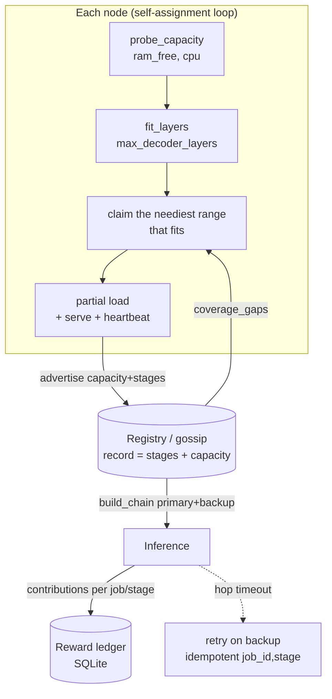

# ADR-0003 — Distributed capacity-aware allocation (auto-assembly, redundancy, reward)

**Status:** Proposed · 2026-06-17
**PRD context:** [part-2 discovery/routing](../prd/part-2-discovery-routing.md), [part-3 queue/load-balancing](../prd/part-3-queue-load-balancing.md), [part-4 incentives/reputation](../prd/part-4-incentives-reputation.md)
**Depends on:** [ADR-0001](./ADR-0001-implementation-forks.md) (DHT record schema, SQLite substrate, `(job_id, stage)` idempotency), [ADR-0002](./ADR-0002-nat-connectivity.md) (pure P2P + coordinator)

---

## 1. Problem

Today, splitting a model across nodes is **manual**: the operator passes `--stages "embed,decoder:0-12"` by hand. Three capabilities are missing:

1. **Knowing what a node can hold.** A 4 GB node cannot host the same layers as a 32 GB one. We need to measure available RAM and translate it into "how many layers". *(The `eujeno fit` command already does the calculation by hand — see §4.1.)*
2. **Auto-assembly.** Nodes should cover the missing layers `[0,N) + embed + head` on their own, without a human assigning the ranges.
3. **Reward proportional to resources.** Whoever provides more RAM/layers, more uptime, and serves more tokens should earn more.

## 2. Decision

| Dimension | Choice | Rationale |
|---|---|---|
| **Allocation** | **Distributed / self-assignment** | Each node reads the coverage gaps from the registry + its own capacity and **claims** a range. No central brain → consistent with pure P2P (ADR-0002). In coordinator mode the same capacity records are reused. |
| **Reward** | **Off-chain ledger (points)** | Tokens deferred. Points accounting persisted (SQLite, ADR-0001); stable formula and units → anchorable to tokens later without a redesign. |
| **Redundancy** | **Target ≥2 nodes per range + failover** | Aligned with the "automatic failover" goal. Inference routes to a primary and falls back to a backup. |

> **Guiding principle (BOINC):** allocation is asynchronous and **eventually consistent**. No strong real-time consensus is needed: gaps close by convergence, conflicts resolve with a deterministic tie-break + backoff. Giving up real-time (ADR-0002) makes all of this simpler, not harder.

## 3. Architecture



### 3.1 Components (files)

| File | Responsibility |
|---|---|
| `eujeno/net/capacity.py` *(new)* | `probe_capacity() -> {ram_total_gb, ram_free_gb, cpu_count}` and `fit_layers(dims, dtype, ram_gb, reserve) -> {ram_per_layer, max_decoder_layers, ram_embed_head, fits_whole}`. **Refactor**: the math is the one already written in `cli.py::fit` — it is extracted here and `fit` calls it (DRY). |
| `eujeno/net/discovery.py` *(mod)* | `coverage_gaps(registry, num_layers, target=2) -> [{lo, hi, replicas}]`: uncovered or **under-replicated** decoder ranges, + status of `embed`/`head`. Sorts by urgency (uncovered first, then under-replicated). |
| `eujeno/net/allocator.py` *(new)* | Self-assignment loop on each node (§3.3). |
| `eujeno/net/rewards.py` *(new)* | Points ledger (§3.5) on SQLite (ADR-0001). |
| `eujeno/cli.py` *(mod)* | `serve --auto` (self-assignment instead of fixed `--stages`); `rewards [--node]`. |
| record schema *(mod)* | Adds `capacity` to the gossip/registry record (§3.2). |

### 3.2 Capacity advertisement (record schema, additive)

The node's presence record in the registry (today: `url`, `stages`, `model`) gains a **`capacity`** field:

```json
{
  "url": "http://10.0.0.4:8001",
  "stages": "decoder:0-8",
  "model": "Qwen/Qwen2.5-7B-Instruct",
  "capacity": {
    "ram_total_gb": 16.0, "ram_free_gb": 11.2, "cpu_count": 8,
    "max_decoder_layers": 22, "dtype": "bfloat16"
  }
}
```

Additive and backward-compatible: a record without `capacity` is treated as unknown capacity (minimal weight in allocation). No breakage with existing nodes.

### 3.3 Self-assignment loop (`serve --auto`)

A node started with `--auto` (instead of fixed `--stages`):

1. **Measures** — `caps = probe_capacity()` → `fit_layers(...)` → maximum number of layers hostable in the chosen dtype.
2. **Observes** — `gaps = coverage_gaps(registry, N, target=2)`, sorted by urgency. `embed`/`head` (the memory outliers: `vocab × hidden` matrix) are preferred by the high-capacity nodes.
3. **Claims** — picks the most urgent gap that **fits** within its capacity and advertises the intended `stages` via gossip, with `claim_ts` + `node_id`.
4. **Resolves conflicts** — if two nodes claim overlapping ranges: deterministic tie-break (older `claim_ts`, on a tie lower `node_id`); the loser does a **jittered backoff** and re-evaluates the next gap. It converges because the gaps shrink each round.
5. **Loads and serves** — partial loading of the assigned layers only, then a periodic heartbeat of `capacity` + `stages`.

**Anti-thrashing (hysteresis):** a node **prefers to keep** its assignment; it only re-assigns if a gap persists for `T` seconds. This avoids flapping on transient registry fluctuations.

**Re-evaluation triggers:** a node joining/leaving (changes coverage) and **a peer's heartbeat timeout** → its range becomes under-replicated → a node with free capacity claims it = **allocation failover**.

### 3.4 Redundancy + failover in inference

- The allocator aims to cover every decoder range + `embed` + `head` with **≥2 nodes**.
- `build_chain` (already existing) is extended to choose, for each stage, a **primary** and to know the **backups**.
- At runtime, if a hop times out / errors at transport, it **retries on the backup**. The retransmission is safe thanks to `(job_id, stage)` idempotency (ADR-0001 #3): a repeated hop does not duplicate the work or the reward accounting.

### 3.5 Reward ledger (off-chain, points-based)

Accounting per **epoch** (every K minutes) and per **completed job**:

```
reward(node) +=  hosted_layers × ram_per_layer_bytes      # resources committed
              ×  uptime_frac                                # reliability in the epoch
              ×  tokens_served                              # actual useful work
              ×  redundancy_bonus(range)                    # bonus if the range has few replicas
```

- `redundancy_bonus` is **higher for ranges with fewer replicas** → it incentivizes covering what is scarce (network anti-collapse).
- **`tokens_served` attribution:** every stage that processes a job's hop records a contribution; at job close the entry (coordinator in relay mode, or the ingress peer in P2P) splits the points among the contributing nodes, **keyed on `(job_id, stage)`** so retries are not counted twice.
- **Persistence:** `ledger(node_id, epoch, points, layers, tokens, uptime)` table on SQLite (ADR-0001 #2 substrate).
- **Exposure:** `eujeno rewards [--node <id>]` + a `/rewards` endpoint + a tab in the frontend.
- **Future tokenization:** the formula and the units (points) stay stable; only the *settlement layer* (on-chain tokens, per-epoch claim) is added later, without touching the accounting.

## 4. CLI surface

| Command | Status |
|---|---|
| `eujeno fit --model <id> --ram <GB> [--dtype]` | ✅ Done (manual calculation, reused by the allocator) |
| `eujeno serve --auto` | 🔜 Self-assignment instead of `--stages` |
| `eujeno rewards [--node <id>]` | 🔜 Shows the ledger |
| `eujeno model --info` | ✅ Provides the dimensions for the calculation |

### 4.1 Starting point
`eujeno fit` (already on `main`) computes `ram_per_layer ≈ params_layer × bytes` with `params_layer ≈ 2·hidden² + 2·hidden·kv_dim + 3·hidden·intermediate`, and suggests a stage spec. The same function becomes `capacity.fit_layers` and feeds step 1 of the self-assignment loop.

## 5. Incremental plan (slices → will become a `writing-plans` plan)

1. **Capacity primitive** — extract `fit_layers` into `net/capacity.py`; add `probe_capacity` (RAM/CPU). Dependency: `psutil` for `ram_free` (fallback to `os.sysconf`/`os.cpu_count` if absent).
2. **Advertisement + gaps** — add `capacity` to the record; `coverage_gaps()` in `discovery.py`.
3. **Allocator** — `allocator.py` (loop, claim, tie-break, hysteresis); `serve --auto`. Test on 2-3 simulated nodes.
4. **Redundancy + failover** — target=2; primary+backup in `build_chain`; idempotent hop retry.
5. **Reward** — `rewards.py` (ledger + `(job_id,stage)` attribution); `eujeno rewards` + endpoint + UI tab.

## 6. Consequences

**Pros:** auto-assembly with no human intervention; heterogeneous nodes (4 GB ↔ 32 GB) used to their fullest; resilience through redundancy; incentives proportional to resources, already accounted for and ready for tokens.

**Cons / risks:**
- Eventually-consistent claim convergence → acceptable with the async framing, but it requires well-tuned tie-break + backoff + hysteresis (flapping risk if misconfigured).
- `psutil` as a new dependency (mitigated by the stdlib fallback).
- Reward attribution depends on reliable per-hop contribution accounting; `(job_id, stage)` idempotency is the linchpin.

## 7. Rejected alternatives
- **Centralized allocator on the coordinator** — easier to optimize globally, but breaks pure P2P. Rejected as the *default*; the same capacity records, however, make it possible as an optional strategy in coordinator mode.
- **On-chain reward right away** — anticipated a deferred part and added dependencies (chain/contract) with no PoC value.
- **Single coverage (1 node per range)** — simpler but without failover; rejected because resilience is a stated goal.
