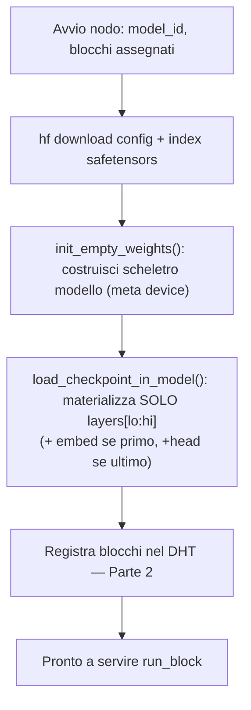

# PRD Parte 1 — Peer Node & Layer Execution

> Decisioni di riferimento: [ADR-0001](../decisions/ADR-0001-implementation-forks.md) (Fork B). Visione: [00-vision-architecture.md](../00-vision-architecture.md).

## 1. Scopo

Il **Peer Node** è l'unità eseguibile di Synapse: un processo che (1) scarica un modello da Hugging Face, (2) ne materializza **solo** i blocchi di layer che si è impegnato a servire, (3) espone una funzione pura `run_block(...)` che trasforma hidden states, e (4) gestisce la KV-cache come oggetto serializzabile che possediamo. Tutto il resto (discovery, queue, reputation) sono altri sottosistemi *dello stesso processo* documentati nelle Parti 2-5.

## 2. In scope (PoC) / Fuori scope

**In scope:**
- Download modello HF (`huggingface_hub` / `transformers`).
- Caricamento parziale: solo i layer `[lo, hi)` assegnati, via `init_empty_weights()` + `load_checkpoint_in_model()`.
- Esecuzione di un blocco: embedding (primo blocco), slab decoder `[lo, hi)`, final-norm + lm_head (ultimo blocco).
- KV-cache serializzabile (`DynamicCache`/tuple di tensori) persistita per `(job_id, stage)`.
- Serializzazione del payload di hop come **safetensors in-memory**.
- `golden_test`: equivalenza numerica vs `model.generate()` single-process.

**Fuori scope (deferred):** quantizzazione, tensor-parallelism intra-layer, modelli 70B+, dtype/model id eterogenei tra nodi (in v1 sono **fissi**).

## 3. Concetti & contratto

### Blocco
Un **blocco** = insieme contiguo di layer `model.model.layers[lo:hi]`. Tre tipi:
- `EMBED` — token embedding (+ rotary setup): `input_ids → h`
- `DECODER[lo:hi]` — slab di layer transformer: `h → h`
- `HEAD` — final norm + lm_head: `h → logits`

### Funzione centrale `run_block`

```python
def run_block(
    hidden_states: Tensor,        # [batch, seq, hidden]  (o input_ids per EMBED)
    attention_mask: Tensor,
    position_ids: Tensor,
    cache_position: Tensor,
    past_kv: DynamicCache | None, # KV-cache locale per questo (job_id, blocco)
) -> tuple[Tensor, DynamicCache]: # (hidden_states_out, new_kv)
    ...
```

**Invariante chiave:** un hop è una **funzione pura** di `(attivazione in ingresso + KV-cache del job)`. Questo è ciò che rende un hop durevole, ripetibile e re-dispatchabile (è il fondamento delle Parti 3 e 5).

### Payload di hop (sul filo)
```
{
  job_id, hop, token_position,
  hidden_states, attention_mask, position_ids, cache_position
}   # serializzato come safetensors bytes in-memory
```
La KV-cache **non** viaggia: resta locale all'holder del blocco (session affinity, vedi Parte 3).

## 4. Flusso di caricamento



## 5. Rischi & mitigazioni (dal team)

- **Off-by-one in `position_ids`/`cache_position`** dopo un hop ripreso → token spazzatura silenziosi. → `golden_test` obbligatorio, ri-eseguito a ogni step.
- **Drift di dtype/device** della cache. → dtype fisso in v1; cache sempre promossa/normalizzata su un device noto.
- **Differenze di accesso ai layer** tra architetture. → astrazione `block_accessor` per famiglia (Llama/Qwen) con test per modello.

## 6. Criteri di accettazione

1. Un nodo carica solo i suoi layer e l'uso di RAM è ~proporzionale ai layer assegnati (non al modello intero, embed/head a parte).
2. `golden_test`: la concatenazione di `run_block` su tutti i blocchi in-process produce logits `torch.allclose` con `model.generate()` (atol/rtol da fissare) per ≥2 architetture (Qwen2.5-0.5B, Llama 3.2 1B).
3. KV-cache serializzata → deserializzata fa round-trip senza perdita; una generazione ripresa da cache persistita == generazione continua.

## 7. Dipendenze

- **Parte 2** consuma: granularità dei blocchi e annuncio nel DHT.
- **Parte 3** consuma: `run_block` come step idempotente; possiede la persistenza della cache keyed `(job_id, stage)`.
- **Parte 5** consuma: il determinismo (modulo FP) di `run_block` per il recompute ridondante.

## 8. Domande aperte

- Granularità: embedding e lm_head come blocchi standalone o co-locati col primo/ultimo slab? (vedi ADR-0001 Q5)
- Versione `transformers` da pinnare per la `Cache` API (ADR-0001 Q2).
