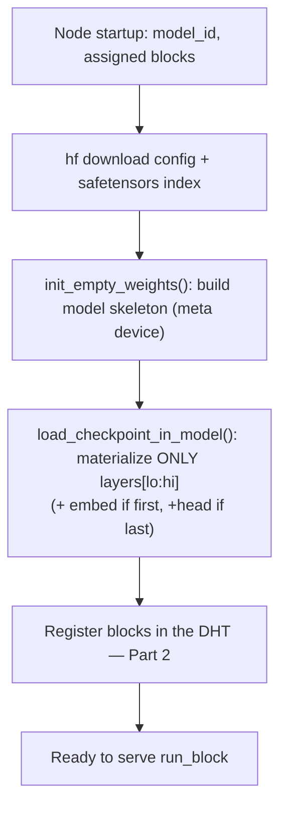

# PRD Part 1 — Peer Node & Layer Execution

> Reference decisions: [ADR-0001](../decisions/ADR-0001-implementation-forks.md) (Fork B). Vision: [00-vision-architecture.md](../00-vision-architecture.md).

## 1. Purpose

The **Peer Node** is the executable unit of Eujeno: a process that (1) downloads a model from Hugging Face, (2) materializes **only** the layer blocks it has committed to serving, (3) exposes a pure `run_block(...)` function that transforms hidden states, and (4) manages the KV-cache as a serializable object that we own. Everything else (discovery, queue, reputation) are other subsystems *of the same process*, documented in Parts 2-5.

## 2. In scope (PoC) / Out of scope

**In scope:**
- HF model download (`huggingface_hub` / `transformers`).
- Partial loading: only the assigned `[lo, hi)` layers, via `init_empty_weights()` + `load_checkpoint_in_model()`.
- Block execution: embedding (first block), decoder slab `[lo, hi)`, final-norm + lm_head (last block).
- Serializable KV-cache (`DynamicCache`/tuple of tensors) persisted per `(job_id, stage)`.
- Serialization of the hop payload as **in-memory safetensors**.
- `golden_test`: numerical equivalence vs single-process `model.generate()`.

**Out of scope (deferred):** quantization, intra-layer tensor-parallelism, 70B+ models, heterogeneous dtype/model id across nodes (in v1 they are **fixed**).

## 3. Concepts & contract

### Block
A **block** = a contiguous set of layers `model.model.layers[lo:hi]`. Three types:
- `EMBED` — token embedding (+ rotary setup): `input_ids → h`
- `DECODER[lo:hi]` — transformer layer slab: `h → h`
- `HEAD` — final norm + lm_head: `h → logits`

### Central function `run_block`

```python
def run_block(
    hidden_states: Tensor,        # [batch, seq, hidden]  (or input_ids for EMBED)
    attention_mask: Tensor,
    position_ids: Tensor,
    cache_position: Tensor,
    past_kv: DynamicCache | None, # local KV-cache for this (job_id, block)
) -> tuple[Tensor, DynamicCache]: # (hidden_states_out, new_kv)
    ...
```

**Key invariant:** a hop is a **pure function** of `(input activation + job KV-cache)`. This is what makes a hop durable, repeatable, and re-dispatchable (it is the foundation of Parts 3 and 5).

### Hop payload (on the wire)
```
{
  job_id, hop, token_position,
  hidden_states, attention_mask, position_ids, cache_position
}   # serialized as in-memory safetensors bytes
```
The KV-cache does **not** travel: it stays local to the block holder (session affinity, see Part 3).

## 4. Loading flow



## 5. Risks & mitigations (from the team)

- **Off-by-one in `position_ids`/`cache_position`** after a resumed hop → silent garbage tokens. → mandatory `golden_test`, re-run at every step.
- **dtype/device drift** of the cache. → fixed dtype in v1; cache always promoted/normalized to a known device.
- **Layer-access differences** across architectures. → `block_accessor` abstraction per family (Llama/Qwen) with per-model tests.

## 6. Acceptance criteria

1. A node loads only its own layers and RAM usage is ~proportional to the assigned layers (not to the whole model, embed/head aside).
2. `golden_test`: chaining `run_block` over all blocks in-process produces logits that are `torch.allclose` with `model.generate()` (atol/rtol to be fixed) for ≥2 architectures (Qwen2.5-0.5B, Llama 3.2 1B).
3. A serialized → deserialized KV-cache round-trips losslessly; a generation resumed from a persisted cache == a continuous generation.

## 7. Dependencies

- **Part 2** consumes: block granularity and the DHT announcement.
- **Part 3** consumes: `run_block` as an idempotent step; owns the cache persistence keyed `(job_id, stage)`.
- **Part 5** consumes: the determinism (modulo FP) of `run_block` for redundant recompute.

## 8. Open questions

- Granularity: embedding and lm_head as standalone blocks or co-located with the first/last slab? (see ADR-0001 Q5)
- The `transformers` version to pin for the `Cache` API (ADR-0001 Q2).
