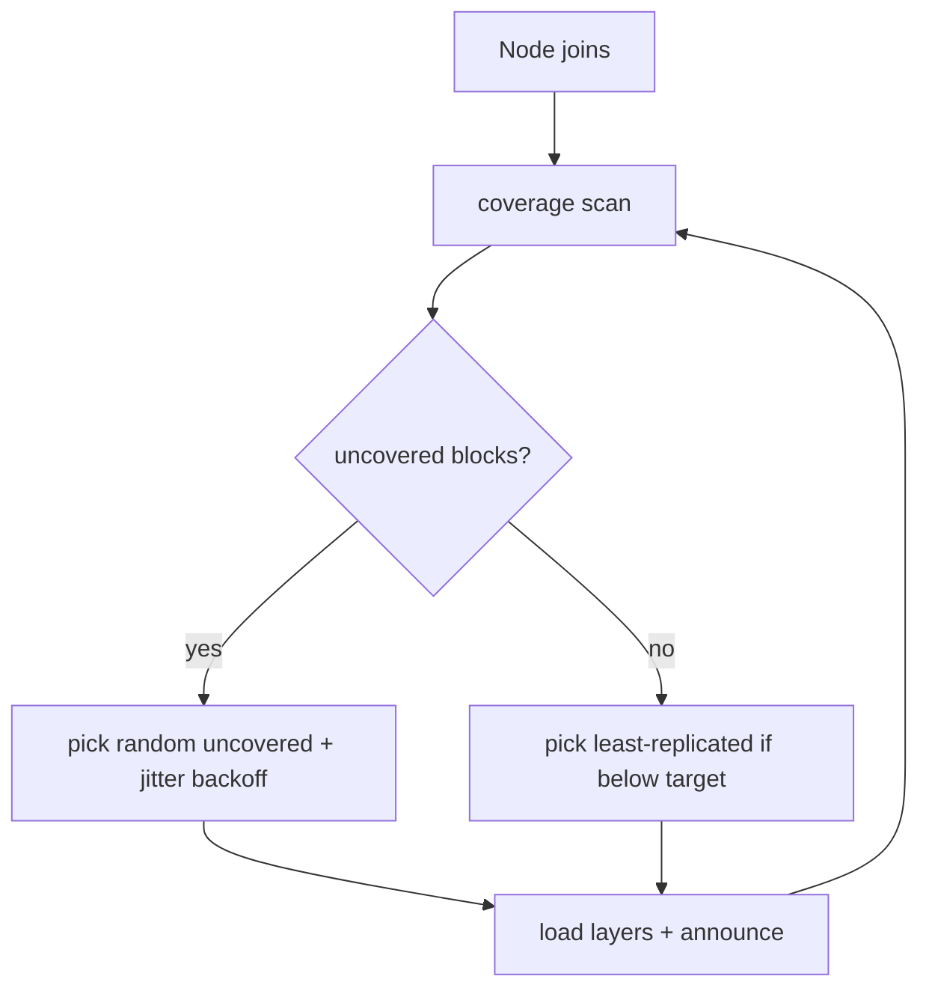

# PRD Part 2 — Discovery & Routing

> Reference decisions: [ADR-0001](../decisions/ADR-0001-implementation-forks.md) (Fork A, E). Vision: [00-vision-architecture.md](../00-vision-architecture.md).

## 1. Purpose

Allow each node to **discover** which peer serves which block, to **self-assign** discovered blocks, to compute **coverage** ("is the model operational?"), and to **route** a hop to a live holder (with failover). All without a central coordinator.

## 2. In scope (PoC) / Out of scope

**In scope:** `DiscoveryProvider` over `hivemind.DHT`; record schema; TTL/refresh as liveness; coverage via key counting; greedy self-assignment with backoff; routing with holder selection + failover.

**Out of scope (deferred):** gossip-CRDT coverage map (v1.1); signed records (open decision ADR-0001 Q6); optimized rebalancing.

## 3. `DiscoveryProvider` interface

An abstraction that decouples the system from hivemind (escape hatch toward kademlia):

```python
class DiscoveryProvider(Protocol):
    def announce(self, block: tuple[int,int], rec: BlockRecord) -> None: ...
    def discover(self, block: tuple[int,int]) -> list[BlockRecord]: ...   # live holders
    def coverage(self, n_layers: int) -> CoverageState: ...
```

Primary implementation: `HivemindDiscovery`. Fallback: `KademliaDiscovery` (vendored `bmuller/kademlia`, LAN/VPN only).

> **Hard constraint (Fork A):** the DHT is **only** the metadata plane. Activations **never** pass through hivemind RPC/streaming — they travel over the durable transport of Part 3.

## 4. DHT record schema (shared primitive #1)

```
key:   f"{model_id}/block:{lo}-{hi}"
value: {
  peer_id:    str,
  queue_url:  str,      # holder inbox endpoint (e.g. http://host:port)
  block:      [lo, hi],
  expiry:     ts,       # TTL ~60s; refresh ~20s = liveness signal
  load:       float,    # queue depth / utilization (for load balancing, Part 3)
  reputation: float,    # score (Part 4/5)
}
```
Also read/written by Part 4 (reputation) and Part 5 (BFT). TTL ~60s, refresh ~20s; coverage is treated as **cached**, eventually consistent state.

## 5. Coverage & operational status (Fork E)

```python
def is_operational(n_layers, provider) -> bool:
    return all(len(provider.discover(block_i)) >= 1 for block_i in blocks(n_layers))
```
- Coverage = a pure function of the live DHT state → the dispatcher (Part 3) calls it *before* admitting a job.
- Local cache with 2-5s TTL on the hot path to dampen lookup storms.
- **v1.1 upgrade:** wrap the scan in a gossip-CRDT map (the TTL cache *is already* the seam).

### Self-assignment
A node that joins:
1. `provider.coverage()` → find uncovered blocks (or least-replicated ones).
2. Picks a block **at random among the uncovered ones** (or the least replicated) with **jittered backoff** (dampens the thundering herd).
3. Loads the layers (Part 1) and `announce`s.



## 6. Routing & failover

For each hop to the next block:
1. `discover(next_block)` → list of live holders.
2. Selection by increasing **load** and decreasing **reputation** (preference).
3. POST the safetensors payload to the chosen `queue_url`.
4. On timeout/error/no-ACK → **re-dispatch** to another holder (the activation is already persisted, Part 3) → no work lost.

## 7. Risks & mitigations (from the team)

- **`p2pd` arch-mismatch / split-brain** → smoke-test gate; pin `initial_peers`; kademlia fallback.
- **TTL flapping** (node going to sleep) → refresh ~20s; cached coverage; requests queue up (acceptable under async framing).
- **Assignment race** (two nodes claim the same block) → harmless waste; random + jitter converge.

## 8. Acceptance criteria

1. Smoke test: store/get of a record across 2-3 real nodes with NAT traversal + TTL liveness.
2. A new node self-assigns an uncovered block and `is_operational()` becomes `True` when all blocks are covered.
3. Killing a holder, within the TTL expiry routing stops selecting it and jobs are re-dispatched.

## 9. Dependencies

- **Part 1:** block granularity.
- **Part 3:** routing delivers to durable inboxes; failover depends on the persisted activation.
- **Parts 4/5:** the record's `load`/`reputation` fields.

## 10. Open questions

- LAN/VPN vs. real NAT (ADR-0001 Q1) → how critical the fallback is.
- Signed records now or later (ADR-0001 Q6).
