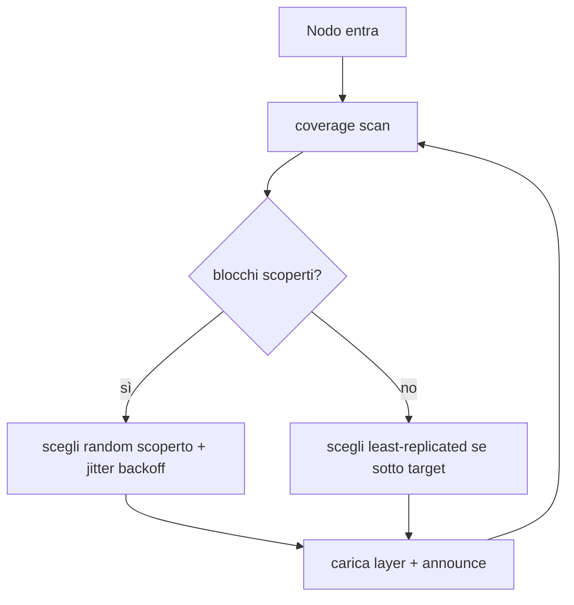

# PRD Parte 2 — Discovery & Routing

> Decisioni di riferimento: [ADR-0001](../decisions/ADR-0001-implementation-forks.md) (Fork A, E). Visione: [00-vision-architecture.md](../00-vision-architecture.md).

## 1. Scopo

Permettere a ogni nodo di **scoprire** quale peer serve quale blocco, di **auto-assegnarsi** blocchi scoperti, di calcolare la **coverage** ("il modello è operativo?"), e di **instradare** un hop verso un holder vivo (con failover). Tutto senza coordinatore centrale.

## 2. In scope (PoC) / Fuori scope

**In scope:** `DiscoveryProvider` su `hivemind.DHT`; schema record; TTL/refresh come liveness; coverage via conteggio chiavi; self-assignment greedy con backoff; routing con scelta holder + failover.

**Fuori scope (deferred):** mappa coverage gossip-CRDT (v1.1); record firmati (decisione aperta ADR-0001 Q6); rebalancing ottimizzato.

## 3. Interfaccia `DiscoveryProvider`

Astrazione che disaccoppia il sistema da hivemind (escape hatch verso kademlia):

```python
class DiscoveryProvider(Protocol):
    def announce(self, block: tuple[int,int], rec: BlockRecord) -> None: ...
    def discover(self, block: tuple[int,int]) -> list[BlockRecord]: ...   # holder vivi
    def coverage(self, n_layers: int) -> CoverageState: ...
```

Implementazione primaria: `HivemindDiscovery`. Fallback: `KademliaDiscovery` (vendored `bmuller/kademlia`, solo LAN/VPN).

> **Vincolo duro (Fork A):** il DHT è **solo** piano metadati. Le attivazioni **non** passano mai per hivemind RPC/streaming — viaggiano sul transport durevole della Parte 3.

## 4. Schema record DHT (primitivo condiviso #1)

```
key:   f"{model_id}/block:{lo}-{hi}"
value: {
  peer_id:    str,
  queue_url:  str,      # endpoint inbox dell'holder (es. http://host:port)
  block:      [lo, hi],
  expiry:     ts,       # TTL ~60s; refresh ~20s = segnale di liveness
  load:       float,    # profondità coda / utilizzo (per load balancing, Parte 3)
  reputation: float,    # score (Parte 4/5)
}
```
Letto/scritto anche da Parte 4 (reputation) e Parte 5 (BFT). TTL ~60s, refresh ~20s; la coverage è trattata come stato **cached** ed eventualmente consistente.

## 5. Coverage & operatività (Fork E)

```python
def is_operational(n_layers, provider) -> bool:
    return all(len(provider.discover(block_i)) >= 1 for block_i in blocks(n_layers))
```
- Coverage = funzione pura dello stato DHT vivo → il dispatcher (Parte 3) la chiama *prima* di ammettere un job.
- Cache locale TTL 2-5s sul hot path per smorzare lookup storm.
- **Upgrade v1.1:** avvolgere lo scan in una mappa gossip-CRDT (la cache TTL *è già* il seam).

### Self-assignment
Un nodo che entra:
1. `provider.coverage()` → trova blocchi scoperti (o least-replicated).
2. Sceglie un blocco **random tra gli scoperti** (o il meno replicato) con **backoff jitterato** (smorza il thundering herd).
3. Carica i layer (Parte 1) e `announce`.



## 6. Routing & failover

Per ogni hop verso il blocco successivo:
1. `discover(next_block)` → lista holder vivi.
2. Scelta per **load** crescente e **reputation** decrescente (preferenza).
3. POST del payload safetensors all'`queue_url` scelto.
4. Su timeout/errore/no-ACK → **ri-dispaccio** a un altro holder (l'attivazione è già persistita, Parte 3) → nessuna perdita di lavoro.

## 7. Rischi & mitigazioni (dal team)

- **`p2pd` arch-mismatch / split-brain** → smoke test gate; pin `initial_peers`; fallback kademlia.
- **TTL flapping** (nodo in sleep) → refresh ~20s; coverage cached; richieste si accodano (accettabile sotto framing async).
- **Race di assegnazione** (due nodi claim lo stesso blocco) → spreco innocuo; random + jitter convergono.

## 8. Criteri di accettazione

1. Smoke test: store/get di un record across 2-3 nodi reali con NAT traversal + TTL liveness.
2. Un nodo nuovo si auto-assegna un blocco scoperto e `is_operational()` diventa `True` quando tutti i blocchi sono coperti.
3. Killando un holder, entro la scadenza TTL il routing smette di sceglierlo e i job vengono ri-dispacciati.

## 9. Dipendenze

- **Parte 1:** granularità blocchi.
- **Parte 3:** il routing consegna a inbox durevoli; il failover dipende dall'attivazione persistita.
- **Parti 4/5:** campi `load`/`reputation` del record.

## 10. Domande aperte

- LAN/VPN vs NAT reale (ADR-0001 Q1) → quanto è critico il fallback.
- Record firmati ora o dopo (ADR-0001 Q6).
