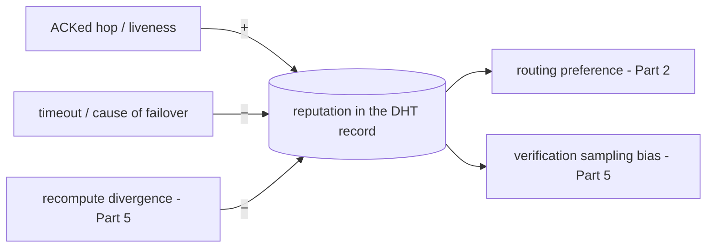

# PRD Part 4 — Incentives & Reputation

> Reference decisions: [ADR-0001](../decisions/ADR-0001-implementation-forks.md) (Fork D). Vision: [00-vision-architecture.md](../00-vision-architecture.md).
>
> **Status:** **Light reputation implemented** in the PoC. Token/cryptocurrency **designed on paper, deferred** (see §5).

## 1. Purpose

Measure and reward node contribution (compute time + bandwidth) and penalize unreliable or dishonest nodes. In the PoC the **operational** part is a **lightweight reputation** that drives routing and allocation; the **economic** part (token) is specified but not implemented.

## 2. In scope (PoC) / Out of scope

**In scope (PoC):** `reputation` field in the DHT record; update rules (success/liveness ↑, timeout/failover/divergence ↓); use of reputation as a routing input (Part 2) and self-assignment (Part 2); local accounting of hop receipts (for the future ledger).

**Out of scope (deferred):** on-chain tokens, settlement, economic staking/slashing, cryptographic proof-of-compute, market/pricing.

## 3. Reputation (operational in the PoC)

- Lives as a `reputation` field in the **same DHT record** (shared primitive #1) — nearly zero cost, already needed for routing/allocation.
- **Update:**
  - `+` for a completed and ACKed hop, for liveness (timely TTL refresh).
  - `−` for a timeout, for being the cause of a failover, for **divergence** in a sampled recompute (Part 5).
- **Use:** the router prefers high reputation; sampled recompute (Part 5) is **biased toward new/low-score nodes**; cold-start handled with a neutral initial score.

## 4. Hop receipts (hook for the future ledger)

Every ACKed hop generates a **local receipt** `{job_id, stage_idx, peer_id, bytes, t_compute}` in the SQLite job log. It has no economic value in the PoC, but it is the **attachment point** where the token ledger will plug in (the job log is also where the job state lives — Part 3).

## 5. Token design (on paper — deferred)

Reference specification for the post-PoC phase; **not** implemented now.

- **What is rewarded:** compute time (per layer × tokens processed) + bandwidth (activation bytes transferred).
- **Unit:** signed, gossiped off-chain credit → later anchored to a chain (EVM/Solana/Cosmos).
- **Slashing:** a proven divergence in a recompute (Part 5) is the **slashing trigger**; the hop receipt is the proof.
- **Sybil resistance:** participation cost / stake; absent today (no identity cost) — risk documented in Part 5.
- **Open precondition:** any hash/commit-reveal-based scheme requires deterministic kernels (canonical-fp32) — see ADR-0001 Fork D.

## 6. Acceptance criteria (PoC)

1. A node's reputation rises with successful hops and falls with timeouts/divergences.
2. The router de-prioritizes a low-reputation node.
3. Every ACKed hop leaves a receipt in the job log.

## 7. Dependencies

- **Part 2:** `reputation` field in the record; use in routing/allocation.
- **Part 3:** receipts in the job log.
- **Part 5:** recompute divergence feeds the reputation (and is the future slashing trigger).

## 8. Open questions

- Exact form of the update rules (decay, time window, bounding).
- When to anchor the credit to a real chain and which one (post-PoC).
