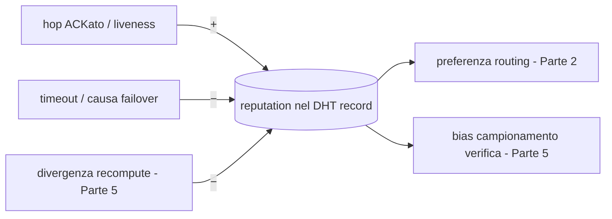

# PRD Parte 4 — Incentivi & Reputazione

> Decisioni di riferimento: [ADR-0001](../decisions/ADR-0001-implementation-forks.md) (Fork D). Visione: [00-vision-architecture.md](../00-vision-architecture.md).
>
> **Stato:** Reputazione **light implementata** nel PoC. Token/criptovaluta **progettati su carta, rimandati** (vedi §5).

## 1. Scopo

Misurare e premiare il contributo dei nodi (tempo di calcolo + banda) e penalizzare i nodi inaffidabili o disonesti. Nel PoC la parte **operativa** è una **reputazione leggera** che guida routing e allocazione; la parte **economica** (token) è specificata ma non implementata.

## 2. In scope (PoC) / Fuori scope

**In scope (PoC):** campo `reputation` nel record DHT; regole di aggiornamento (successo/liveness ↑, timeout/failover/divergenza ↓); uso della reputazione come input di routing (Parte 2) e self-assignment (Parte 2); contabilità locale delle ricevute di hop (per il futuro ledger).

**Fuori scope (deferred):** token on-chain, settlement, staking/slashing economico, proof-of-compute crittografico, mercato/pricing.

## 3. Reputazione (operativa nel PoC)

- Vive come campo `reputation` nello **stesso record DHT** (primitivo condiviso #1) — costo quasi nullo, già necessaria per routing/allocazione.
- **Aggiornamento:**
  - `+` per hop completato e ACKato, per liveness (refresh TTL puntuale).
  - `−` per timeout, per essere causa di failover, per **divergenza** in un recompute campionato (Parte 5).
- **Uso:** il router preferisce alta reputazione; il recompute campionato (Parte 5) è **biased verso nodi nuovi/low-score**; cold-start gestito con score neutro iniziale.

## 4. Ricevute di hop (hook per il futuro ledger)

Ogni hop ACKato genera una **ricevuta locale** `{job_id, stage_idx, peer_id, bytes, t_compute}` nel job log SQLite. Non ha valore economico nel PoC, ma è il **punto di aggancio** dove il ledger a token si innesterà (il job log è anche dove vive lo stato del job — Parte 3).

## 5. Design del token (su carta — deferred)

Specifica di riferimento per la fase post-PoC; **non** implementata ora.

- **Cosa si premia:** tempo di calcolo (per layer × token processati) + banda (bytes di attivazione trasferiti).
- **Unità:** credito off-chain firmato e gossipato → in seguito ancorato a una chain (EVM/Solana/Cosmos).
- **Slashing:** una divergenza provata in un recompute (Parte 5) è il **trigger di slashing**; la ricevuta di hop è la prova.
- **Sybil resistance:** costo di partecipazione / stake; oggi assente (nessun costo di identità) — rischio documentato in Parte 5.
- **Precondizione aperta:** un eventuale schema basato su hash/commit-reveal richiede kernel deterministici (canonical-fp32) — vedi ADR-0001 Fork D.

## 6. Criteri di accettazione (PoC)

1. La reputazione di un nodo sale con hop riusciti e scende con timeout/divergenze.
2. Il router de-prioritizza un nodo a bassa reputazione.
3. Ogni hop ACKato lascia una ricevuta nel job log.

## 7. Dipendenze

- **Parte 2:** campo `reputation` nel record; uso in routing/allocazione.
- **Parte 3:** ricevute nel job log.
- **Parte 5:** la divergenza nel recompute alimenta la reputazione (ed è il futuro trigger di slashing).

## 8. Domande aperte

- Forma esatta delle regole di aggiornamento (decay, finestra temporale, bounding).
- Quando ancorare il credito a una chain reale e quale (post-PoC).
