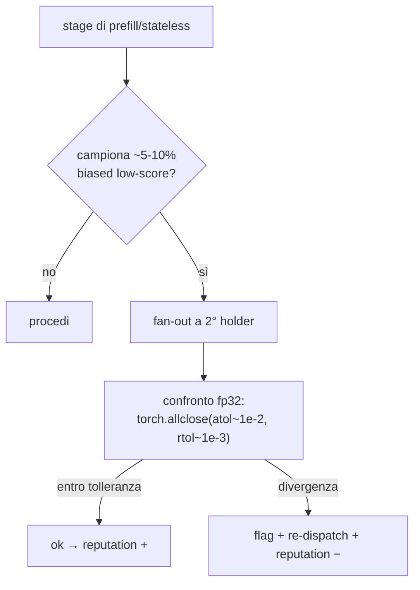

# PRD Parte 5 — Sicurezza & Byzantine Fault Tolerance

> Decisioni di riferimento: [ADR-0001](../decisions/ADR-0001-implementation-forks.md) (Fork D). Visione: [00-vision-architecture.md](../00-vision-architecture.md).
>
> **Stato:** verifica **light implementata** nel PoC; BFT completo, commit-reveal e staking **su carta, rimandati**.

## 1. Scopo

Difendere l'integrità del calcolo distribuito contro nodi difettosi o malevoli, gestire i fallimenti parziali della rete, e definire (su carta) il percorso verso una BFT completa. Principio: nel PoC i nodi sono per lo più fidati (li possediamo), quindi la verifica è **probabilistica ed economica**, non sistematica.

## 2. In scope (PoC) / Fuori scope

**In scope (PoC):** recompute ridondante **campionato** (~5-10%) reputation-gated; confronto attivazioni in **fp32 con tolleranza**; gestione fallimenti parziali via store-and-forward (Parte 3); integrità basilare in transito.

**Fuori scope (deferred):** consenso/quorum sugli output, commit-reveal, slashing economico, sybil resistance economica, attestazioni crittografiche, kernel deterministici.

## 3. Verifica campionata (operativa nel PoC)

Riusa **lo stesso primitivo di fan-out** del failover/ridondanza (Parte 3) — un solo code path keyed `(job_id, stage)`.

**Regole dure (dal team):**
- **Mai hash-compare.** Il non-determinismo FP tra hardware eterogeneo fa sì che nodi *onesti* producano byte diversi → l'uguaglianza di hash fallisce sempre. Si confrontano tensori promossi a **fp32** con tolleranza empirica.
- **Solo hop stateless/prefill.** Verificare a metà generazione richiederebbe replay della KV-cache sul 2° holder → si verifica solo ai confini di sessione/prefill.
- **Campionamento, non sistematico.** Verificare ogni stage = ~2x compute, uccide il vantaggio async.

## 4. Gestione fallimenti parziali della rete

Lo store-and-forward durevole (Parte 3) **assorbe** partizioni temporanee: il lavoro si accoda (`WAITING_COVERAGE`, outbox con retry/backoff), non si perde. Una partizione split-brain mostra coverage piena su ciascun lato ma nessuno completo (intrinseco all'eventual consistency) — mitigato dal pinning del bootstrap.

## 5. Integrità in transito (PoC, basilare)

- Payload safetensors con campo di lunghezza/checksum per rilevare corruzione di trasporto.
- **Record DHT firmati:** decisione aperta (ADR-0001 Q6) — economici e forward-compat per reputation/BFT; da decidere se pagarli ora.

## 6. Modello di minaccia & roadmap BFT (su carta)

| Minaccia | PoC | Deferred (full BFT) |
|----------|-----|---------------------|
| Nodo restituisce attivazioni spazzatura | recompute campionato + reputation − | quorum N-su-M + slashing |
| Nodo mente "in piccolo" sotto tolleranza | accettato (tolleranza larga) | kernel deterministici + commit-reveal |
| Sybil (molte identità) | nessun costo identità (rischio noto) | stake economico / proof-of-work d'ingresso |
| Free-riding (annuncia, non calcola) | reputation decade su timeout | slashing dello stake |
| Replay / tampering payload | checksum + (opz.) firme | record firmati obbligatori + nonce |

**Commit-reveal:** rimandato e **flaggato potenzialmente non-viabile** finché non si adottano kernel canonici fp32/interi deterministici (precondizione nell'ADR-0001 Fork D).

## 7. Rischi & mitigazioni (dal team)

- **Falsi positivi** tra nodi onesti eterogenei (CPU vs GPU, BF16) → confronto in fp32 con tolleranza **misurata** (non assunta) sull'hardware reale.
- **Tolleranza troppo larga** → un avversario nasconde una piccola bugia (accettato nel PoC; difesa reale rimandata).
- **Verifica mid-generazione** → vincolata a prefill/confini di sessione.

## 8. Criteri di accettazione (PoC)

1. Un nodo deliberatamente difettoso (output perturbato oltre tolleranza) viene rilevato da un recompute campionato e declassato in reputazione.
2. Due nodi onesti su hardware diverso **non** generano falsi positivi con le tolleranze scelte.
3. Una partizione di rete temporanea non causa perdita di job (si accodano e riprendono).

## 9. Dipendenze

- **Parte 1:** determinismo (modulo FP) di `run_block`.
- **Parte 2:** holder ridondanti da `discover`; record (firma) DHT.
- **Parte 3:** fan-out/persistenza/re-dispatch condivisi con la verifica.
- **Parte 4:** la divergenza alimenta la reputazione ed è il futuro trigger di slashing.

## 10. Domande aperte

- Valori empirici atol/rtol sull'hardware reale (ADR-0001 Q4).
- Firma dei record DHT ora o dopo (ADR-0001 Q6).
