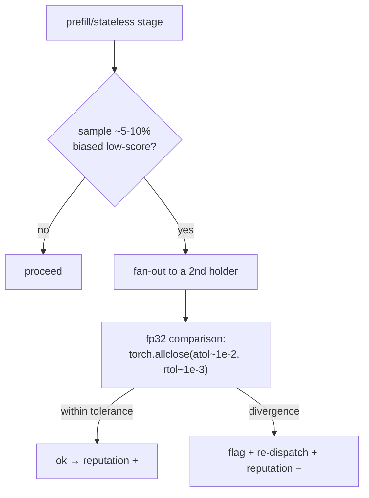

# PRD Part 5 — Security & Byzantine Fault Tolerance

> Reference decisions: [ADR-0001](../decisions/ADR-0001-implementation-forks.md) (Fork D). Vision: [00-vision-architecture.md](../00-vision-architecture.md).
>
> **Status:** **light verification implemented** in the PoC; full BFT, commit-reveal and staking **on paper, deferred**.

## 1. Purpose

Defend the integrity of distributed computation against faulty or malicious nodes, handle partial network failures, and define (on paper) the path toward full BFT. Principle: in the PoC the nodes are mostly trusted (we own them), so verification is **probabilistic and cheap**, not systematic.

## 2. In scope (PoC) / Out of scope

**In scope (PoC):** **sampled** redundant recompute (~5-10%), reputation-gated; activation comparison in **fp32 with tolerance**; partial-failure handling via store-and-forward (Part 3); basic in-transit integrity.

**Out of scope (deferred):** consensus/quorum on outputs, commit-reveal, economic slashing, economic sybil resistance, cryptographic attestations, deterministic kernels.

## 3. Sampled verification (operational in the PoC)

Reuses the **same fan-out primitive** as failover/redundancy (Part 3) — a single code path keyed `(job_id, stage)`.

**Hard rules (from the team):**
- **Never hash-compare.** FP non-determinism across heterogeneous hardware means *honest* nodes produce different bytes → hash equality always fails. Tensors promoted to **fp32** are compared with an empirical tolerance.
- **Stateless/prefill hops only.** Verifying mid-generation would require replaying the KV-cache on the 2nd holder → verification happens only at session/prefill boundaries.
- **Sampling, not systematic.** Verifying every stage = ~2x compute, kills the async advantage.

## 4. Partial network-failure handling

The durable store-and-forward (Part 3) **absorbs** temporary partitions: work queues up (`WAITING_COVERAGE`, outbox with retry/backoff), it is not lost. A split-brain partition shows full coverage on each side but no complete one (intrinsic to eventual consistency) — mitigated by pinning the bootstrap.

## 5. In-transit integrity (PoC, basic)

- Safetensors payload with a length/checksum field to detect transport corruption.
- **Signed DHT records:** open decision (ADR-0001 Q6) — cheap and forward-compatible for reputation/BFT; to be decided whether to pay for them now.

## 6. Threat model & BFT roadmap (on paper)

| Threat | PoC | Deferred (full BFT) |
|--------|-----|---------------------|
| Node returns garbage activations | sampled recompute + reputation − | N-of-M quorum + slashing |
| Node lies "small" under tolerance | accepted (wide tolerance) | deterministic kernels + commit-reveal |
| Sybil (many identities) | no identity cost (known risk) | economic stake / proof-of-work on entry |
| Free-riding (announces, doesn't compute) | reputation decays on timeout | stake slashing |
| Replay / payload tampering | checksum + (opt.) signatures | mandatory signed records + nonce |

**Commit-reveal:** deferred and **flagged as potentially non-viable** until canonical deterministic fp32/integer kernels are adopted (precondition in ADR-0001 Fork D).

## 7. Risks & mitigations (from the team)

- **False positives** among honest heterogeneous nodes (CPU vs GPU, BF16) → fp32 comparison with a tolerance **measured** (not assumed) on the real hardware.
- **Tolerance too wide** → an adversary hides a small lie (accepted in the PoC; real defense deferred).
- **Mid-generation verification** → constrained to prefill/session boundaries.

## 8. Acceptance criteria (PoC)

1. A deliberately faulty node (output perturbed beyond tolerance) is detected by a sampled recompute and downgraded in reputation.
2. Two honest nodes on different hardware do **not** generate false positives with the chosen tolerances.
3. A temporary network partition does not cause job loss (jobs queue up and resume).

## 9. Dependencies

- **Part 1:** the determinism (modulo FP) of `run_block`.
- **Part 2:** redundant holders from `discover`; DHT record (signature).
- **Part 3:** fan-out/persistence/re-dispatch shared with verification.
- **Part 4:** divergence feeds the reputation and is the future slashing trigger.

## 10. Open questions

- Empirical atol/rtol values on real hardware (ADR-0001 Q4).
- Signing of the DHT records now or later (ADR-0001 Q6).
